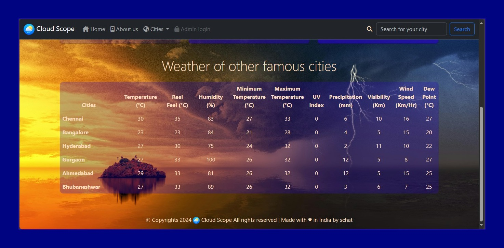

# Cloud Scope

Cloud Scope is a web application that provides weather information for various cities. Users can view real-time weather data such as temperature, humidity, wind speed, and more for selected cities.


## Deployment
The project has been deployed at Netlify, experience the responsive UI and sleek design at [CloudScope](https://cloud-scope.netlify.app/).

## Screenshots





## API Reference
The APP first searches for the Location Key using the ```name of the city``` entered and ```API Key```.

Then, it fetches the current weather data using ```Location Key``` and ```API Key```

The app uses the free ```AccuWeather API``` service.
## Features

- **Navigation:** Easy-to-use navigation bar with links to home, about us, and city selection.
- **Weather Display:** Displays current weather conditions including temperature, humidity, wind speed, and other relevant data.
- **Interactive:** Users can select cities from a dropdown menu or use a search bar to find weather information quickly.
- **Responsive Design:** Built using Bootstrap, ensuring a responsive and mobile-friendly user experience.
- **Alerts:** Alerts users about API usage to manage daily query limits effectively.

#### 🔍 Search Functionality

- **Search Bar:** Effortlessly find weather information for any city by typing in the search bar. Enhance your experience by exploring weather conditions in cities worldwide.

#### 📊 Detailed Weather Tables

- **City Comparison Table:** Compare weather conditions across major cities in a user-friendly tabular format. See metrics like temperature, humidity, UV index, and more at a glance.

#### ⚠️ User Advisory

- **API Usage Alert:** Built-in alert system to notify users about the limited number of daily searches due to the free API usage cap, encouraging efficient usage of resources.

## 🛠️ Technologies Used

### Frontend

- **HTML5:** For structuring the content.
- **CSS3:** Enhanced with [Bootstrap 5](https://getbootstrap.com/) for responsive design and styling.
- **JavaScript:** Dynamic content handling and API integration.
- **FontAwesome:** Elegant icons to enrich user experience.

## 🌐 API Integration

Cloud Scope utilizes a free `AccuWeather API` to fetch real-time weather data. This integration allows users to get the most accurate and up-to-date information with minimal latency.
## 🤝 Contributing
We welcome contributions to make **Cloud Scope** even better! Here's how you can contribute:

1. Fork the repository.
2. Create a new branch (git checkout -b feature-branch).
3. Make your changes and commit them (git commit -m 'Add new feature').
4. Push to the branch (git push origin feature-branch).
Open a pull request.


## Acknowledgements
- **Icons:** FontAwesome for icons used in the navigation and weather information.
- **API:** Integrated with a free [AccuWeather API](https://developer.accuweather.com/) for fetching real-time weather data.
 - **README:** [How to write a Good readme](https://readme.so/)